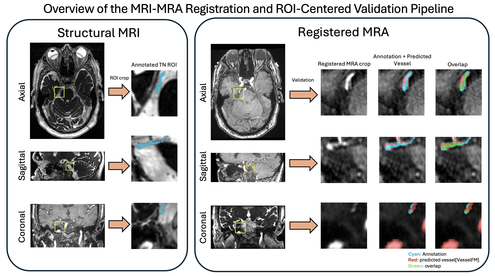

# Evaluation Principles for MRI–MRA Registration in Trigeminal Neuralgia: An ROI-Centered Neurovascular Benchmark



Code for the paper *"Evaluation Principles for MRI–MRA Registration in Trigeminal
Neuralgia: An ROI-Centered Neurovascular Benchmark"* (submitted to *IEEE
Transactions on Medical Imaging*).

We formulate trigeminal-neuralgia (TN) MRI–MRA fusion as an **ROI-centered
neurovascular registration-evaluation** problem and benchmark six representative
registration pipelines using local image-based metrics, segmentation-derived
vessel-localization metrics, prediction-volume analysis, and contrast-/FOV-
stratified comparisons. This repository contains (1) the **pipeline**
(preprocessing → registration) and (2) the **evaluation** code that produces the
paper's metrics, tables, and figures.

> **No patient data is included.** The cohort is IRB-governed clinical imaging and
> is not distributed here. Scripts reference data by path only; point them at your
> own data via the `REG_ROOT` environment variable (see below).

## Repository layout

```
preprocessing/        DICOM→NIfTI RAS normalization, brain masks, ROI autocrop
Baseline_Methods/     One subfolder per registration method (the "pipeline")
  ANTs/               run_ants_affine.py (Affine), run_ants_syn.py (SyN)
  ConvexAdam/         run_convexadam_batch.py, run_convexadam_cpu_fallback.py,
                      affine_prealign.py                            (uses MIR)
  FireANTs/           run_fireants_batch.py
  EasyReg/            run_easyreg.py            (FreeSurfer CLI)
  SynthMorph/         run_synthmorph.py         (FreeSurfer CLI)
eval/                 ROI-centered evaluation package (metrics, tables, figures)
visualization/        Per-case rendering utilities used by eval figures
labels/               Build the trigeminal-centroid index
reader_study/         Blinded reader-study packet assembly
analysis/             FOV metadata, supplementary table S1
tools/                Environment/system-info capture for reproducibility
results/              Aggregate result figures + metric tables from the paper
```

## The six registration methods

| Method | Category | Script | External dependency |
|--------|----------|--------|---------------------|
| ANTs Affine | Affine | `Baseline_Methods/ANTs/run_ants_affine.py` | ANTs CLI |
| ANTs SyN | Classical deformable | `Baseline_Methods/ANTs/run_ants_syn.py` | ANTs CLI |
| ConvexAdam | Optimization-based | `Baseline_Methods/ConvexAdam/run_convexadam_batch.py` | MIR + PyTorch |
| FireANTs | Optimization-based | `Baseline_Methods/FireANTs/run_fireants_batch.py` | `fireants`, GPU |
| EasyReg | Learning-based | `Baseline_Methods/EasyReg/run_easyreg.py` | FreeSurfer ≥7.4 |
| SynthMorph | Learning-based | `Baseline_Methods/SynthMorph/run_synthmorph.py` | FreeSurfer ≥7.4 |

ConvexAdam and FireANTs are supplied with the ANTs-Affine output as a unified
external pre-alignment, matching the paper's protocol. A small number of
high-resolution ConvexAdam cases that exceed single-GPU memory are processed on
CPU with `run_convexadam_cpu_fallback.py`; `affine_prealign.py` is the standalone
SimpleITK affine pre-alignment utility.

## Registration configuration

Per-method configuration used for the benchmark (**no external brain or
registration mask was supplied to any method**):

- **ANTs Affine / SyN** — Mattes mutual information for the rigid/affine stages and
  cross-correlation for the SyN deformable refinement, over a multi-resolution
  schedule (`run_ants_affine.py` / `run_ants_syn.py`).
- **ConvexAdam** — `ConvexAdam_MIND_brain_default` configuration with MIND-SSC
  descriptors; intensity normalized at the 99.5th percentile.
- **FireANTs** — moments-based center-of-mass / rigid initialization followed by a
  multi-resolution greedy deformable stage.
- **EasyReg / SynthMorph** — FreeSurfer default configuration.

**Downstream vessel segmentation (VesselFM, Track B).** Warped MRA volumes were
intensity-normalized to [0, 1] by 1st–99th-percentile scaling with clipping, then
segmented with sliding-window inference (128³ patches, 0.5 overlap, constant-mode
merging, no test-time augmentation). Predictions were binarized at a 0.5 threshold;
connected components smaller than 500 voxels (face–edge–vertex connectivity) were
removed; no additional filtering was applied.

## Installation

```bash
pip install -r requirements.txt
```

A conda base environment is also provided. Conda users can create it with
`conda env create -f environment.yml` (it bundles Python, ANTs, and Jupyter); the
full scientific-Python dependency set is authoritative in `requirements.txt`, so
install those on top with `pip install -r requirements.txt` inside the env.

Some components are **not** on PyPI and must be installed separately:

- **MIR** — third-party medical-image-registration toolbox used by ConvexAdam.
  Install from <https://github.com/junyuchen245/MIR> and point the ConvexAdam
  scripts at it via the `MIR_SRC` environment variable (its `src/` directory), or
  `pip install -e .` inside its repo so `import MIR` resolves. *MIR is not vendored
  in this repository.*
- **ANTs** — `antsRegistration` / `antsApplyTransforms` on `PATH`.
- **FreeSurfer ≥ 7.4** — provides `mri_synthmorph` (SynthMorph) and `mri_easyreg`
  (EasyReg).
- **VesselFM** — downstream vessel segmentation for Track B (run on each warped
  MRA to produce `*_vessel_mask.nii.gz`); see the VesselFM repository.

## Environment and hardware

The exact software and hardware used to produce the paper's results:

**Software**

| Component | Version |
|-----------|---------|
| Python | 3.10.19 |
| PyTorch | 2.10.0+cu128 (CUDA 12.8) |
| ANTs | 2.6.2 |
| FireANTs | 1.0.0 |
| ConvexAdam | via the MIR toolbox |
| EasyReg / SynthMorph | FreeSurfer 8.1.0 |
| VesselFM | v1.0 (`dyn_unet_base`, no retraining) |

PyTorch must match your own CUDA toolkit — install the corresponding build from the
[official PyTorch index](https://pytorch.org/get-started/locally/) (we used the
`cu128` build for CUDA 12.8).

**Hardware**

- 2× AMD EPYC 9354 (128 threads total)
- 1.5 TB RAM
- 8× NVIDIA RTX PRO 6000 Blackwell (96 GB each)

GPU-accelerated methods (ConvexAdam, FireANTs) require a CUDA GPU; the ANTs and
FreeSurfer methods run on CPU and were batch-parallelized across cores.

## Imaging acquisition parameters (N = 149 patients)

Continuous parameters: median [Q1, Q3] (range). Categorical: count (%).
Derived from DICOM headers; in-plane/slice spacing confirmed from NIfTI headers.

| Parameter | Structural MRI (CISS-type) | TOF-MRA |
|-----------|----------------------------|---------|
| **Vendor and scanner** | | |
| Manufacturer (Siemens / GE) | 146 (98.0%) / 3 (2.0%) | 146 (98.0%) / 3 (2.0%) |
| Most common model | Skyra 115 (77.2%); Verio 12 (8.1%); Aera 9 (6.0%); MAGNETOM Vida 5 (3.4%); other 8 (5.4%) | Skyra 112 (75.2%); Verio 13 (8.7%); Aera 9 (6.0%); MAGNETOM Vida 7 (4.7%); other 8 (5.4%) |
| Field strength (3.0 T / 1.5 T) | 138 (92.6%) / 11 (7.4%) | 137 (91.9%) / 12 (8.1%) |
| **Sequence parameters (DICOM)** | | |
| Predominant series | POST/PRE CISS SAG MPR (and reconstructions) | TOF_3D_multi-slab (130/149); MRA cow (7); other (12) |
| TR (ms) | 5.45 [5.43, 5.46] (5.00–7.84) | 22.00 [22.00, 22.00] (19.00–25.00) |
| TE (ms) | 2.42 [2.41, 2.43] (2.04–3.66) | 3.78 [3.78, 3.78] (3.40–7.15) |
| Slice thickness, DICOM (mm) | 0.60 [0.60, 0.60] (0.59–1.00) | 0.50 [0.50, 0.60] (0.40–1.20) |
| **Volume geometry (NIfTI)** | | |
| In-plane spacing (mm) | 0.597 [0.597, 0.597] (0.372–0.880) | 0.260 [0.260, 0.288] (0.260–0.482) |
| Slice spacing (mm) | 0.594 [0.594, 0.594] (0.150–0.859) | 0.500 [0.500, 0.600] (0.400–0.800) |
| Median matrix shape | 254 × 256 × 164 | 646 × 768 × 165 |
| **Acquisition timing** | | |
| Study date range | 2020-01-05 to 2022-12-20 | 2019-10-08 to 2022-12-20 |

## Data layout

All scripts resolve data under `REG_ROOT`:

```bash
export REG_ROOT=/path/to/TN_Reg
export VFM_ROOT=/path/to/vesselfm_results   # optional, for Track B
export MIR_SRC=/path/to/MIR/src             # for ConvexAdam
```

See [`eval/README.md`](eval/README.md) for the full expected directory structure.

## Running the pipeline

```bash
# 1. Preprocessing  (DICOM already converted to NIfTI)
python preprocessing/preprocess_ras_normalization.py --test_cases <CASE_ID> ...
python preprocessing/generate_brain_masks.py         --test_cases <CASE_ID> ...
python preprocessing/autocrop_with_mask.py           --test_cases <CASE_ID> ...

# 2. Registration  (run each method; outputs land under $REG_ROOT/outputs/...)
python Baseline_Methods/ANTs/run_ants_affine.py
python Baseline_Methods/ANTs/run_ants_syn.py
python Baseline_Methods/ConvexAdam/run_convexadam_batch.py
# high-res cases that exceed single-GPU memory:
#   python Baseline_Methods/ConvexAdam/run_convexadam_cpu_fallback.py
python Baseline_Methods/FireANTs/run_fireants_batch.py
python Baseline_Methods/EasyReg/run_easyreg.py
python Baseline_Methods/SynthMorph/run_synthmorph.py

# 3. ROI-centered evaluation  (see eval/README.md)
python -m eval.compute_metrics
python -m eval.make_tables
python -m eval.figures.overview_figures
python -m eval.figures.coupling_figures
python -m eval.figures.stratified_figures
python -m eval.stratify
```

## Results

`results/` contains the aggregate figures and metric tables reported in the paper
(method-level statistics only — no patient-level data). Per-case anatomy figures
(Fig. 1 / Fig. 4 / Fig. 8) are **not** included; the de-identified, parameterized
code to regenerate them from your own data is in `eval/figures/`.

## A note on de-identification

This is a clean, public release of code originally developed on a clinical server.
Patient identifiers, private paths, and embedded outputs have been removed; example
case IDs appear only as the placeholder `<CASE_ID>`. The repository ships no
imaging, no patient identifiers, and no notebook outputs.

## Citation

```bibtex
@article{zhang_tnreg,
  title   = {Evaluation Principles for MRI--MRA Registration in Trigeminal
             Neuralgia: An ROI-Centered Neurovascular Benchmark},
  author  = {Zhang, Xupeng and Wang, Xihang and Xie, Michael and Liang, Haoyuan
             and Lien, Hau Ern and Das, Oishika and Feghali, James and Xu, Risheng
             and Liu, Peirong},
  journal = {IEEE Transactions on Medical Imaging (submitted)},
  year    = {2026}
}
```

## License

Released for research use. See `LICENSE` (add your chosen license, e.g. MIT or
Apache-2.0, before publishing).
